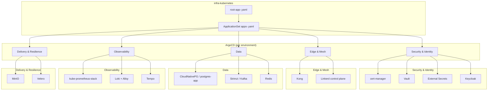
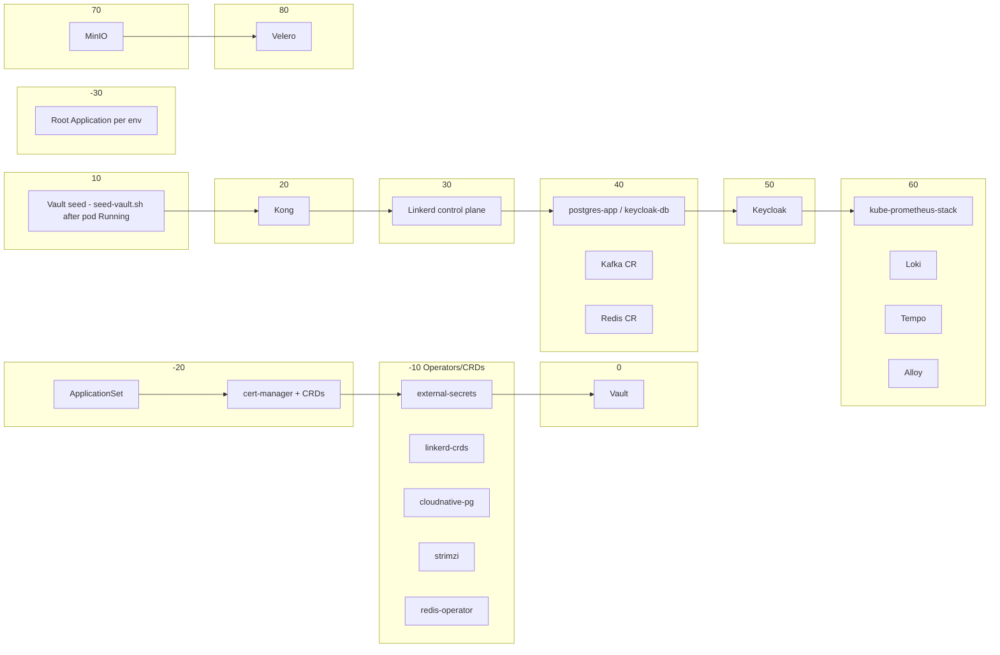
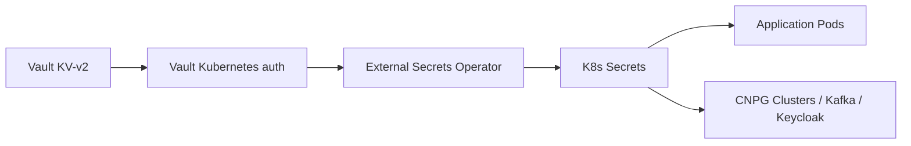

# Platform Architecture

Reference for the `sca` platform on Kubernetes: layers, the component catalog,
sync-waves, namespaces, the secret flow and the environment model. This is a
**state document** — how the platform *is*. Beyond ArgoCD, cert-manager
(Phase 1), Vault (Phase 2), external-secrets (Phase 3), linkerd-crds (Phase 4)
and cloudnative-pg (Phase 5) are deployed; every other catalog entry is marked
`planned` until its phase lands. For how changes *flow* through the platform, see
[workflow.md](workflow.md); for what is done and what is next, see
[status.md](status.md).

## Overview

`infra-kubernetes` is the single source of truth for the platform. ArgoCD (in
each environment cluster) reconciles this repository via an app-of-apps
pattern per environment: one root `Application`
(`argocd/root-app-<env>.yaml`) renders one `ApplicationSet`
(`argocd/apps-<env>.yaml`) that generates one `Application` per component
from a list generator. There is **no global `ServerSideApply`**, Kong is a
dedicated `Application`, and `postgres-app` is a local raw `Application` (see
[Sync-wave map](#sync-wave-map) and the [Deviations log](#deviations-log)).
Nothing is deployed by hand after `make bootstrap`.

## Layers

Every box above is either an upstream Helm chart, a set of raw manifests, or
both. This repository builds no images.

## Component catalog

The catalog has **17 components**. Each row shows its intended namespace,
upstream chart, ArgoCD sync-wave and roadmap phase. Chart and image pins are
set per component when that phase lands (values live under
`infrastructure/<component>/` and `envs/<env>/` from Phase 1 on); in the table
ArgoCD, cert-manager (Phase 1), Vault (Phase 2), external-secrets (Phase 3),
linkerd-crds (Phase 4) and cloudnative-pg (Phase 5) are deployed, the rest are
`planned`.

| Component | Namespace | Upstream chart | Wave | Phase | Status |
| --- | --- | --- | --- | --- | --- |
| cert-manager | `cert-manager` | jetstack/cert-manager | -20 | 1 | deployed (Phase 1) |
| vault | `vault` | hashicorp/vault | 0 | 2 | deployed (Phase 2) |
| external-secrets | `external-secrets` | external-secrets/external-secrets | -10 | 3 | deployed (Phase 3) |
| linkerd-crds | `linkerd` | linkerd/linkerd-crds | -10 | 4 | deployed (Phase 4) |
| cloudnative-pg | `cloudnative-pg` | cloudnative-pg/cloudnative-pg | -10 | 5 | deployed (Phase 5) |
| strimzi | `strimzi` | strimzi/strimzi-kafka-operator | -10 | 6 | planned (Phase 6) |
| redis-operator | `data` | ot-container-kit/redis-operator | -10 | 7 | planned (Phase 7) |
| kong | `kong` | kong/kong (DB-less) | 20 | 8 | planned (Phase 8) |
| linkerd control plane | `linkerd` | linkerd/linkerd2 (script) | 30 | 9 | planned (Phase 9) |
| postgres-app (+ keycloak-db) | `data` | CNPG `Cluster` CR (raw) | 40 | 10 | planned (Phase 10) |
| kafka (CR) | `data` | `Kafka` + `KafkaNodePool` CRs | 40 | 11 | planned (Phase 11) |
| redis (CR) | `data` | `Redis` CR | 40 | 12 | planned (Phase 12) |
| keycloak | `keycloak` | bitnami/keycloak | 50 | 13 | planned (Phase 13) |
| kube-prometheus-stack | `observability` | prometheus-community/kube-prometheus-stack | 60 | 14 | planned (Phase 14) |
| loki | `loki` | grafana/loki | 60 | 15 | planned (Phase 15) |
| alloy | `observability` | grafana/alloy | 60 | 15 | planned (Phase 15) |
| tempo | `tempo` | grafana/tempo | 60 | 16 | planned (Phase 16) |
| minio | `minio` | minio/minio | 70 | 17 | planned (Phase 17) |
| velero | `velero` | vmware-tanzu/velero | 80 | 18 | planned (Phase 18) |
| argocd | `argocd` | argoproj/argo-cd (Makefile bootstrap) | -30 | 0.0 | deployed — root app OutOfSync until the repo is live |

Notes:

- **Status column** is the source of truth for "is it live?". ArgoCD,
  cert-manager (Phase 1), Vault (Phase 2), external-secrets (Phase 3),
  linkerd-crds (Phase 4) and cloudnative-pg (Phase 5) are deployed; every
  other component is `planned (Phase N)`. The column is flipped to `deployed` inside the phase
  that lands the component, and `status.md` is updated in the same commit.
- `postgres-app` is a **local-only** raw `Application` (not in the
  `ApplicationSet` generator list) and also defines the `keycloak-db` CNPG
  cluster in `data` used by Keycloak in every environment. The Kafka and Redis
  **operators** (waves -10) are installed everywhere; their **custom resources**
  live in `data` at wave 40.
- `kong` is a dedicated `Application` per environment (not via the
  `ApplicationSet`): flat-schema CRDs break ArgoCD's structured-merge diff
  under `ServerSideApply=true`, so it runs DB-less with `installCRDs: false`
  and no SSA (see [Deviations log](#deviations-log)).
- The Linkerd control plane is **not** an ArgoCD app: it is deployed by a
  script (Phase 9) after cert-manager and linkerd-crds are up.
- `local` is the only environment running the full catalog including the
  observability stack, MinIO and Velero. See [Environment model](#environment-model).

## Sync-wave map

ArgoCD applies resources in `sync-wave` order (`argocd.argoproj.io/sync-wave`),
integers spaced ≥10 apart so dependencies are always satisfied. Wave -30 is
the root app; the ApplicationSet and cert-manager sit at -20; the operators
and CRDs at -10; then Vault and everything downstream.

Key relationships:

- **ESO (wave -10) before Vault-secret consumers**: every `ExternalSecret`
  needs the `external-secrets` operator and the `vault` `ClusterSecretStore`.
- **Vault (wave 0) before Kong/Keycloak/datastores**, and `seed-vault.sh`
  (wave 10) runs after the Vault pod is `Running` — it is CI/manual, not an
  ArgoCD hook.
- **Kong (wave 20) before everything behind the gateway.**
- **kube-prometheus-stack (wave 60) before the radar** — the `ServiceMonitor`
  and `PrometheusRule` CRDs ship with this app. The radar design is in
  [observability-radar.md](observability-radar.md).

## Secret flow

- Secrets are declared **once** in Vault at `secret/<service>/<env>` and
  projected to native Kubernetes `Secret`s by ESO. The cluster never stores
  the original secret; only the projected copy. `.secrets/` (disk only) is
  gitignored.
- ESO `refreshInterval` is short (~5 min) in `local` to avoid the
  ExternalSecret wedge that broke the previous attempt — no manual ESO
  restarts.

Full inventory and runbooks: [secrets.md](secrets.md).

## Namespace scheme

| Namespace | Purpose |
| --- | --- |
| `argocd` | ArgoCD control plane, root Applications, ApplicationSets |
| `cert-manager` | TLS certificate management |
| `vault` | Secrets SSOT |
| `external-secrets` | Secret projection from Vault |
| `linkerd` | Service mesh CRDs and control plane |
| `cloudnative-pg` | PostgreSQL operator |
| `strimzi` | Kafka operator |
| `kong` | API gateway |
| `data` | Datastores: postgres-app, keycloak-db, Kafka, Redis |
| `keycloak` | OIDC identity provider |
| `observability` | Metrics + Grafana + Alertmanager, Alloy log collection |
| `loki` | Log aggregation (named after the chart, unlike the observability ns) |
| `tempo` | Distributed tracing |
| `minio` | S3-compatible object storage (local only) |
| `velero` | Cluster backup/restore |

## Environment model

| Environment | Profile | Sync policy | Purpose |
| --- | --- | --- | --- |
| `local` | 1 replica, full catalog, minimal resources | auto-sync + prune | Developer machine (kind) |
| `dev` | reduced HA | auto-sync + prune | Shared integration |
| `qa` | HA (3 replicas, PDBs, anti-affinity) | auto-sync, **no prune** | Pre-production validation |
| `prod` | full HA, real storage | **manual sync** | Production |

Sync policies follow ADR-003. Promotion between environments is gated by the
`promote-test` (see [workflow.md](workflow.md)).

Per-component replica profile (intended values; materialized as each phase
lands — cert-manager is done):

| Component | local | dev | qa | prod |
| --- | --- | --- | --- | --- |
| cert-manager | 1 | 2 | 3 | 3 |
| vault (HA raft) | 1 | 1 | 3 | 3 |
| external-secrets | 1 | 2 | 3 | 3 |
| cloudnative-pg | 1 | 1 | 2 | 2 |
| strimzi | 1 | 1 | 2 | 2 |
| redis | 1 | 1 | 2 | 3 |
| kong (gateway/controller) | 1/1 | 2/2 | 3/3 | 3/3 |
| keycloak | 1 | 2 | 3 | 3 |
| postgres-app | 1 | local-only | local-only | local-only |

- Vault `server.dataStorage.size`: `1Gi` default, `10Gi` (qa), `20Gi` (prod).
- Keycloak uses `podAntiAffinityPreset: hard` in `qa` and `prod`.
- `local` is the only environment that deploys the observability stack, MinIO
  and Velero, because it also plays the role of the demo/CI substrate.

## Deviations log

Repository-specific decisions, each with the reason. Appended by later phases
as each component lands; the log always explains *why*, never just *what*.

| Component | Deviation | Reason |
| --- | --- | --- |
| Root app (local) | Live `automated.enabled=false` (applied during Phase 0.0 while `GIT_REPO_URL` was an unpublished GitHub placeholder) is dropped once the local git serve provides content; the files keep auto + prune | Closed by the Phase 1 follow-up: the serve now renders a valid `apps-local.yaml` (row below), so the seamless file-state auto-sync applies and the override is removed |
| git-local-serve (local tooling) | Serves a **rendered** `argocd/apps-local.yaml`: `bootstrap/render-served-apps.sh` substitutes `{{GIT_REPO_URL}}`/`{{GIT_TARGET_BRANCH}}` and commits the copy onto the serve branch only — the repo templates keep the placeholders for the `make bootstrap` seam and the published-repo path | ArgoCD renders the root app's ApplicationSet straight from the served file; an unsubstituted `{{GIT_TARGET_BRANCH}}` is invalid YAML (unquoted) and broke `platform-root-local` (`ComparisonError`). Dev-only stand-in, not part of the platform catalog |
| git-local-serve (local tooling) | In-cluster git server does **not** use the `alpine/git` image (it ships no `git daemon`); it boots `alpine:3.21` and installs `git-daemon`, plus `safe.directory` for the root-owned bare repo | `alpine/git` lacks the `git daemon` subcommand; the bare mirror on the node is owned by another user, which trips git's "dubious ownership" guard. Local tooling only — not part of the platform catalog |
| Kong | DB-less (`database: off`), `ingressController.installCRDs: false`, managed as a dedicated `Application`, no SSA | Kong ships flat-schema CRDs; structured-merge diff breaks under `ServerSideApply=true`, and `--include-crds` re-emits CRDs twice |
| postgres-app | Local raw `Application`, not in the `ApplicationSet` generator list | Only `local` runs the datastore; it must be applied without the env generator |
| Linkerd | Control plane deployed by script, not ArgoCD | Helm chart signature requirements; control plane needs cert-manager + linkerd-crds first |
| ESO | Short `refreshInterval` (~5 min) in local | Avoids the ExternalSecret wedge that wedged the previous attempt; restarts only ever manual after bootstrap |
| Vault | `local` runs the **full HA raft trio** (`server.ha.replicas: 3`) rather than the "1 replica local" profile the pre-Phase-2 docs implied; each env overlay now declares `server.ha.replicas` explicitly (local/qa/prod = 3, dev = 1), and `replicaCount` (a no-op for raft HA) is dropped | The user keeps HA in local on purpose: the raft quorum + standby→leader redirect (`vault-active`) must be exercised on the same path the smoke and qa/prod exercise, so `make smoke COMPONENT=vault` validates real HA, not a single-node special case; dev stays single-node to keep the shared integration light |
| Vault | The jetstack `hashicorp/vault` chart defaults to `global.tlsDisable: true`, which injects plain-http probe addresses that break against the TLS listener; we set `global.tlsDisable: false` and add `retry_join` with `leader_ca_cert_file` in the raft storage block | The chart ships no `retry_join` and no HTTPS probe wiring; without these the readiness probe (`vault status`) spoke HTTP to an HTTPS listener and the raft peers failed to join (`certificate signed by unknown authority` until the CA file was passed) |
| AppSet (CRD apps) | CRD `ignoreDifferences` extended with `.spec.conversion`, `.spec.names.listKind` and `.spec.preserveUnknownFields` (on top of `.spec.versions[].schema` and `.status`) | The API server defaults these fields on served CRDs even when the chart does not declare them, so without the ignore every CRD-shipping app shows a perpetual, non-convergent `OutOfSync`. The fields are server-derived, not genuine drift — the applied CRD content is still the git-pinned chart |
| linkerd-crds (local) | Five leftover Linkerd CRDs from the pre-restart bulk install (2026-09-02) removed manually: the conflicting `servers`/`serviceprofiles` and the orphaned `egressnetworks`, `externalworkloads`, `httplocalratelimitpolicies` (managed by no app) | SSA cannot remove extra CRD versions or objects it does not manage, so the newer-version leftovers made the app converge to a permanent `OutOfSync`. After cleanup the chart 1.8.0 app re-applied pristine definitions and re-converged to `Synced`. One-off cluster hygiene, not repo state |
| cloudnative-pg + future-phase CRDs (local) | Same one-off cluster hygiene extended: **60 orphaned CRDs** from the 2026-09-02 bulk install removed — the 11 `postgresql.cnpg.io` (Phase 5) plus the undeployed groups `kafka.strimzi.io`/`core.strimzi.io` (10, Phase 6), `redis.redis.opstreelabs.in` (4, Phase 7), `configuration.konghq.com` (12, Phase 8), `monitoring.coreos.com`/`monitoring.grafana.com` (11, Phase 14) and `velero.io` (13, Phase 18). All lacked ArgoCD ownership (`helm.sh/resource-policy: keep`, no tracking labels) | Extra CRDs not owned by any app wedge the app that ships them into a permanent `OutOfSync` under SSA (same as the linkerd-crds row); each future phase would have hit the same gate. The converging `cloudnative-pg` app re-created its 11 CRDs as app-owned and converged `Synced`+`Healthy`; the undeployed groups were plain leftovers. ArgoCD, cert-manager, external-secrets and linkerd CRDs untouched |

## Change flow (summary)

Full detail in [workflow.md](workflow.md): a change lands via PR, is validated
by CI (static always; selective cluster smoke of the touched component from
Phase 1 — a required PR check, profile `local` — see [ci-cd.md](ci-cd.md)),
merges to `main`, and each environment's ArgoCD applies it according to its own
sync policy (`local`/`dev` auto, `qa` auto-no-prune, `prod` manual by a human).
