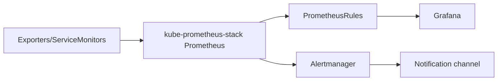

# Observability Radar

The metrics pipeline and the alerting "radar" for the platform, **as
designed**. Status: `planned` — nothing in this file is live until
kube-prometheus-stack lands in Phase 14. See [architecture.md](architecture.md)
for its sync-wave (60) and [workflow.md](workflow.md) for the prod deploy
window it serves.

## Pipeline

- **kube-prometheus-stack** brings Prometheus, Grafana, Alertmanager and the
  `ServiceMonitor`/`PrometheusRule` CRDs. It is selected by label, not Helm
  values: `serviceMonitorSelectorNilUsesHelmValues: false` /
  `ruleSelectorNilUsesHelmValues: false`, so the custom radar objects are
  picked up by `app.kubernetes.io/name` label.
- **Radar ServiceMonitors**: component-level `ServiceMonitor`s (Kong, Vault,
  etc.) feed the platform dashboards; deployed per component from Phase 8 on.
- **Radar PrometheusRules**: the alert set described below.

## Radar alerts (as designed)

Severity `info` by design: the radar **flags**, it never pages and never
auto-syncs. Production still requires a human.

| Alert | Fires when | Severity | Action |
| --- | --- | --- | --- |
| `ProdSyncPending` | a prod app is OutOfSync/pending | info | start the deploy-window review |
| `DeploymentWindowOpen` | the prod deploy window is open | info | trigger the human go/no-go, unless tracking issues are present |
| Tracking-issue coalescence | any tracking issue present at window open | info | block the window, resolve first |

Alertmanager routing lives in Vault (`secret/platform/alertmanager`,
`useExistingSecret`), so recipients are fast-lived data editable without a PR
(see [secrets.md](secrets.md) and the [deviations log](architecture.md#deviations-log)).

## Status

- CRDs (`ServiceMonitor`, `PrometheusRule`): not present until Phase 14.
- Radar YAML manifests: not written yet — they ship with the
  kube-prometheus-stack phase, in the same commit, because they depend on its
  CRDs.
- The `argocd_app_info` metric (from `controller.metrics.enabled` /
  `repoServer.metrics.enabled`) feeds `ProdSyncPending`; those flags are part
  of the ArgoCD install (Phase 0.0).
- `make port-forward APP=prometheus|grafana` is the local way to reach the UI
  once deployed.
