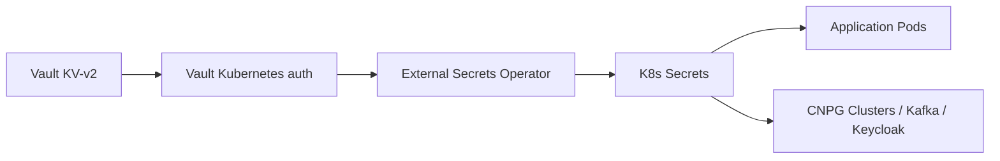

# Secrets: Vault + External Secrets Operator

Vault is the **single source of truth** for secrets; External Secrets Operator
(ESO) projects Vault KV into native Kubernetes `Secret`s. The cluster stores
only projected copies, never the originals. This is a state document — Vault is
not deployed yet (Phase 2); the design below is normative for the phases that
consume it.

In addition to the cluster plane below there is a **repository plane**: the CI
release secrets stored as GitHub Actions secrets, documented at the end of this
file (the two planes never touch).

## Design

- **Vault**: KV-v2 secrets engine, HA raft storage, sealed/initialized by the
  Phase 2 runbook. TLS certificates for the Vault pod come from cert-manager
  (Phase 1).
- **Kubernetes auth**: Vault authenticates ESO with the service account token;
  ESO is bound to a role scoped to the `secret/<service>/<env>` paths.
- **ESO**: one `ClusterSecretStore` back to Vault plus one `ExternalSecret`
  per consumed secret. `refreshInterval` is short (~5 min) in `local`.
- **`.secrets/`**: gitignored, disk only — used by `seed-vault.sh` inputs and
  never committed.

## KV path inventory

Paths are structured `secret/<service>/<env>`. The inventory below is **as
designed**; each path is only written by the phase that needs it (the seed
script adapts as components land).

| Path | Written by | Consumed by |
| --- | --- | --- |
| `secret/cert-manager/acme` | Phase 1 seed | cert-manager (ACME/issuer creds, if any) |
| `secret/vault/unseal` | Phase 2 | Vault unseal workflow |
| `secret/external-secrets/k8s-auth` | Phase 2 | k8s auth role/SA binding |
| `secret/kong/admin` | Phase 8 | Kong admin |
| `secret/postgres-app/<env>` | Phase 10 | postgres-app `Cluster` via CNPG |
| `secret/keycloak-db/<env>` | Phase 10 | keycloak-db `Cluster` via CNPG |
| `secret/kafka/<env>` | Phase 11 | Kafka SCRAM users |
| `secret/redis/<env>` | Phase 12 | Redis `Secret` auth |
| `secret/keycloak/admin` | Phase 13 | Keycloak bootstrap admin |
| `secret/grafana/admin` | Phase 14 | Grafana admin |
| `secret/minio/root` | Phase 17 | MinIO root credentials |
| `secret/velero/credentials` | Phase 18 | Velero object-store credentials |
| `secret/platform/alertmanager` | Phase 14 | Alertmanager routing config (`useExistingSecret`) |

Nothing in the inventory is written yet — Vault arrives at Phase 2.

## Seed script

`bootstrap/seed-vault.sh` populates Vault after the pod is `Running` (wave 10;
CI/manual, **not** an ArgoCD hook). It is:

- **Idempotent**: re-runs converge to the same state, no cascade of new
  versions.
- **Adaptive**: it seeds a path only when the consuming component's files
  exist (e.g. the Alertmanager config key is skipped until
  kube-prometheus-stack lands in Phase 14).
- Inputs come from `.secrets/` on disk — never from git.

## ESO short-refresh rationale

The previous attempt wedged every `ExternalSecret` because Vault was sealed and
the refresh interval kept them in `Error` forever. In `local`, `refreshInterval`
is short (~5 min) so a path that appears late is picked up automatically.
Consequence: **no manual ESO restarts** — if a secret is missing, fix the path
or the role, not the pod (see [workflow.md](workflow.md)).

## Per-component secret flow

Each phase that consumes secrets ships, next to the component, exactly one
`ExternalSecret` per secret plus the k8s-auth role grant:

1. Vault path exists (`bootstrap/seed-vault.sh`).
2. `ExternalSecret` targets `secret/<service>/<env>` via the
   `ClusterSecretStore`.
3. Pods reference the projected `Secret` by name; the raw value never appears
   in a manifest.
4. DoD for that phase includes `make status` showing `SecretSynced`.

Velero diverges only in *target*: `local` uses the in-cluster MinIO, while
`dev`/`qa`/`prod` use external S3 with credentials injected via Vault/ESO.
See [architecture.md](architecture.md) and [observability-radar.md](observability-radar.md).

## Repository secrets (GitHub Actions)

A different secret plane from Vault/ESO: the two **release** secrets are stored
as **GitHub Actions secrets** at the **repository** level (not org, not
environment) and consumed only by the `Release` workflow
([.github/workflows/release.yml](../.github/workflows/release.yml)). Vault stays
the SSOT for *cluster* secrets; this is where CI *automation* secrets live.

| Secret | Purpose |
| --- | --- |
| `RELEASE_PLEASE_TOKEN` | PAT so release PRs opened by release-please trigger the required CI checks (see [versioning.md](versioning.md)) |
| `RELEASE_GPG_PRIVATE_KEY` | Release-bot signing key armor (see [versioning.md](versioning.md)) |

Storage model (GitHub):

- GitHub keeps a **per-repository keypair**. The public half is exposed via
  `GET /repos/{owner}/{repo}/actions/secrets/public-key`; the plaintext never
  touches the API.
- Setting a secret means encrypting the value **client-side** as a libsodium
  **sealed box** (`crypto_box_seal`) with that public key and `PUT`/`PATCH`ing
  it to `actions/secrets/{name}`. GitHub decrypts in its backend and stores the
  secret **encrypted at rest**; the API returns only `name` / `created_at` /
  `updated_at` — never the value.
- The secrets are available in CI **only** through
  `${{ secrets.<NAME> }}` inside `release.yml`, are handed to the runner only
  for the jobs that reference them, and are masked (`***`) in the logs.
- **Rotating a value** (e.g. swapping the PAT to a dedicated release-bot
  account) replaces only the value: fetch the current public key, re-encrypt,
  `PATCH` the secret — or use Settings → Secrets → Actions. No workflow change
  is involved.
- Plaintext never lands in git, in the API, or on runner disk. The local
  counterpart `.secrets/` (disk, gitignored) feeds
  `bootstrap/seed-vault.sh` and is never used for release secrets.
