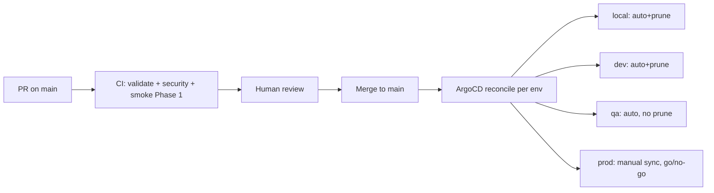

# GitOps Workflow

How a change in `infra-kubernetes` becomes a deployment in an environment
cluster. Companion to [architecture.md](architecture.md) (the *state*) and
[ci-cd.md](ci-cd.md) (the *pipeline*).

## Mental model

- The repository is the single source of truth **for the platform catalog**.
  Each environment cluster runs an ArgoCD that reconciles a root `Application`
  (`argocd/root-app-<env>.yaml`) from this repo; sync policies follow ADR-003.
- **Services are not part of that catalog.** Each service is the owner of its
  own `deploy/` manifest and is deployed through the refs its environment
  tracks (`deploy/dev`, `deploy/qa`, `main`) in its own repository — the
  service `promote` action moves those refs. See
  [Services (app-repo-as-source)](#services-app-repo-as-source).
- A platform-change becomes a deployment by landing in `main`; ArgoCD does the
  rest. **Nothing is deployed by hand after `make bootstrap`.**
- Changes land via reviewed PRs. A component often ships as a single PR, but
  the number of PRs/commits is a judgment call driven by the change (grouping
  is not a rule). A component that does not turn green **rolls back**
  (`git revert`-style), it is never patched forward with `fix` chains.

## Change → deploy flow (platform components)

This is the flow for the platform catalog (Vault, Kong, …). Services use the
ref-based flow in
[Services (app-repo-as-source)](#services-app-repo-as-source) instead.

1. **Author**: edit only the files the change owns (component + its env
   overlays), run `make validate-static`, commit with a conventional message
   per logical change (`feat(vault): …`, `fix(kong): …`). Group the related
   commits into one or more reviewed PRs as the change dictates — grouping is
   a judgment call, not a fixed rule.
2. **CI**: static suite always; from Phase 1 a *selective* cluster smoke of the
   touched component also runs as a required PR check (`Smoke` on `main`,
   ephemeral `kind`, profile `local`) — see
   [ci-cd.md](ci-cd.md).
3. **Review**: a human reviews the diff; the reviewer is the gate for "turns
   green" (the per-component DoD in [status.md](status.md)).
4. **Merge**: ArgoCD picks it up per environment based on the sync policy.
   `prod` requires a human to press `Sync` in a deploy window.

## Environments and promotion

Promotion means different things for the two kinds of tenants this repository
describes:

- **Platform components** (the catalog in [architecture.md](architecture.md)):
  centralized in `infra-kubernetes`. Advancing a component from one environment
  to the next is a **promotion**, and it is always a separate PR that touches
  only that env's `envs/<env>/` overlays plus `argocd/apps-<env>.yaml` (the
  registry).
- **Services** (microservices like `nest-authz`): they own their manifests in
  their own repo (`deploy/`), and their environment placement is a **movable
  git ref**, not a PR in `infra-kubernetes` — see
  [Services (app-repo-as-source)](#services-app-repo-as-source).

### Services (app-repo-as-source)

A service is deployed through the ref of its own repository that each
environment's ArgoCD tracks:

| Env | Ref tracked by ArgoCD | Deploy trigger | Gate |
| --- | --- | --- | --- |
| `dev` | `deploy/dev` | service `promote` action moves the ref | none — last deployer wins |
| `qa` | `deploy/qa` | `promote` action moves the ref | free, after a dev pass |
| `prod` | `main` | merge of the post-qa PR | **manual Sync** in the deploy window |

The `promote` action (lives in the service repo) builds the image, pins the tag
in `deploy/env/<env>.yaml`, points the env ref at that commit, and lets the
ArgoCD pull model apply it. A PR to the service `main` only happens **after**
the change has passed dev and qa; prod comes exclusively from that merged
`main`. `local`/`dev`/`qa`/`prod` sync policies still follow ADR-003. The full
contract for a service lives in [onboarding-new-service.md](onboarding-new-service.md).

```mermaid
graph LR
    A[Feature commit] --> B[promote action: build + pin tag]
    B --> C["move deploy/dev ref"]
    C --> D[ArgoCD dev: auto + prune]
    D --> E[validate dev]
    E --> F["move deploy/qa ref"]
    F --> G[ArgoCD qa: auto, no prune]
    G --> H[validate qa]
    H --> I[PR to service main]
    I --> J[Human review + merge]
    J --> K[ArgoCD prod: manual Sync in window]
```

### Platform components

| Env | Sync | Provenance of secrets | Notes |
| --- | --- | --- | --- |
| `local` | auto + prune | vault seeded via `bootstrap/seed-vault.sh` | kind; full platform catalog, no services |
| `dev` | auto + prune | real Vault secrets | reduced HA |
| `qa` | auto, **no prune** | real Vault secrets | 3 replicas, PDBs, anti-affinity |
| `prod` | **manual** | real Vault secrets | full HA, real storage; human go/no-go in the deploy window |

**promote-test**: before promoting a platform component to `dev`/`qa`/`prod`,
validate the target env overlay on a local `kind` cluster loaded with
`ENV=dev|qa|prod` (`make bootstrap ENV=<env>` against the same overlay).
Promotion of a platform component is only allowed when the promote-test passes
and the component is green in the lower environment. Services do not use
`promote-test` — their pre-PR validation is exactly the dev → qa flow.

## The escalation gate

If a component fails its gate (app not Healthy, pods crash-looping, smoke
red), the response is **rollback, not forward-churn**:

- **Platform component**: revert the offending commit (or the environment's
  view of it via the overlay), merge the revert, let ArgoCD reconcile it back.
- **Service**: point the env ref back at the previous known-good commit (the
  ref move is itself the rollback — no new commit needed for dev/qa; for prod,
  revert the merge on the service `main`).
- Investigate *why* it failed *before* attempting it again — never string
  `fix` commits onto a broken sync.
- Update [status.md](status.md) and the component's phase row to reflect the
  rollback; the doc records reality, not intent.

No ad-hoc `ignoreDifferences` patches, no `ServerSideApply=true` toggles, no
manual `kubectl apply` after bootstrap. If ArgoCD drift needs absorbing, it is
a deliberate, documented deviation (the [Deviations log](architecture.md#deviations-log)).

## Queued PRs, branch names and main-sync

- **Branch names are a whitelist.** A ruleset (`allowed-branches-only`)
  rejects any branch outside `~DEFAULT_BRANCH` plus the conventional prefixes
  `feat/`, `feature/`, `chore/`, `fix/`, `hotfix/`, `hf/`, `refactor/`,
  `docs/`, `test/`, `ci/`, `build/`, `style/`, `dependabot/`, `copilot/` and
  `release-please--branches--`. A push whose branch is not on the list is
  rejected (`422`).
- **A branch name never decides whether a release happens.** release-please
  only bumps on `feat`/`fix` commits that reach the deployed platform: the
  type must be `feat`/`fix` **and** at least one file must fall outside the
  `exclude-paths` directories (`.github`, `bootstrap`, `0.Project_info`)
  from `.release-please-config.json`. `docs`, `chore`, `test`,
  `ci` and refactors never open a release PR either way. Keep unreleased work
  off `feat`/`fix` titles **and** out of platform paths — the "immunity" is
  the commit type plus the paths, not the branch.
- **Open PRs update themselves.** After every push to `main`, the
  `main-sync` workflow merges the new `main` into each open PR's branch and
  pushes it back (same-repo only; conflicts are left untouched and reported
  on the PR). PRs queued behind a merge therefore converge automatically —
  and, by design, each update dismisses the approval
  (`require_last_push_approval`), so the latest code is always what gets
  reviewed.

## Troubleshooting quick refs

| Symptom | Probable cause | Fix |
| --- | --- | --- |
| App `OutOfSync` | Drift or failed sync-wave | `kubectl get application <name> -n argocd`; inspect `status.conditions`; sync manually if prod |
| `SecretSyncedError` on an ExternalSecret | Vault path missing or k8s-auth role wrong | Check the `ClusterSecretStore` is Ready; verify `secret/<service>/<env>`; re-run `bootstrap/seed-vault.sh` (local) |
| Pods crash after a wave bump | Dependency started before its datastore/operator | Re-check wave assignment; consumers must be ≥10 above their dependency |
| ESO wedged (local) | Was running with the old long refresh pattern | Do **not** restart by hand; short refresh (~5 min) prevents recurrence |
| `ImagePullBackOff` | Bad pin or unreachable registry | Verify the pinned tag exists upstream; never float `latest` |
| Service not updating in dev/qa | `promote` action did not move the env ref | Check the service repo's `deploy/dev` / `deploy/qa` ref; move it to the intended commit |
| Service `OutOfSync` in dev/qa semantics | Ref points at a commit whose tree changed | Inspect the service `Application` (`kubectl -n argocd get application <svc>-<env>`); ensure `main` merge only after qa |
| kind cluster OOM | Host RAM exhausted | Stop sibling Compose stacks before bootstrapping; use the 1-replica local profile |
